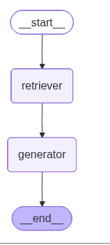

# 💰 Financial Intelligence RAG Assistant

> *A production-ready Retrieval-Augmented Generation system for grounded personal finance Q&A — built with LangGraph, ChromaDB, and OpenAI.*

---

## 📌 Project Overview

This project demonstrates an end-to-end **Financial Intelligence Assistant** that answers personal finance questions with **strict grounding and zero hallucination**. The system processes a corpus of **30 curated financial guidance documents** and delivers accurate, source-backed answers using a modern RAG (Retrieval-Augmented Generation) architecture.

The pipeline is orchestrated using **LangGraph** — a graph-based LLM workflow engine — making the system modular, observable, and production-ready.

---

## 🏗️ Architecture

```
User Question
     │
     ▼
┌──────────────────────────────────────────────────────┐
│                  LangGraph RAG Pipeline               │
│                                                      │
│   ┌────────────┐       ┌──────────────────────┐      │
│   │  Retriever │──────▶│     Generator (LLM)  │      │
│   │   Node     │       │   GPT-4.1-mini + RAG │      │
│   └────────────┘       └──────────────────────┘      │
│         ▲                         │                  │
│         │                         ▼                  │
│   Hybrid Search              Grounded Answer         │
│   (Semantic + BM25)          + Source Citations      │
└──────────────────────────────────────────────────────┘
         ▲
         │
  ChromaDB Vector Store
  (30 Financial Docs)
```

# Rag Pipeline



## ✨ Key Features

| Feature | Description |
|---|---|
| 🧠 **Hybrid Retrieval** | Combines semantic vector search (ChromaDB) + BM25 keyword matching via Reciprocal Rank Fusion |
| 🔗 **LangGraph Pipeline** | Stateful, graph-based execution with typed state schema for full observability |
| 🚫 **Hallucination Prevention** | System prompt strictly limits answers to retrieved context only |
| 📚 **Rich Document Store** | 30 financial guidance documents covering credit, budgeting, retirement, investing, and more |
| 🧪 **Comprehensive Testing** | 5 test queries including multi-document synthesis and adversarial out-of-scope questions |
| 💾 **Persistent Vector DB** | ChromaDB with local SQLite persistence — embeds once, loads fast on every run |

---

## 🛠️ Tech Stack

| Layer | Technology |
|---|---|
| **LLM** | `gpt-4.1-mini` (OpenAI) — `temperature=0` for deterministic outputs |
| **Embeddings** | `text-embedding-3-small` (OpenAI) — 1536-dim cosine similarity |
| **Vector Store** | ChromaDB (persistent, local SQLite) |
| **Orchestration** | LangGraph `StateGraph` |
| **Keyword Search** | BM25 (`rank-bm25`) via LangChain Community |
| **Hybrid Fusion** | `EnsembleRetriever` with Reciprocal Rank Fusion (RRF) |
| **Framework** | LangChain + LangChain Classic |
| **Environment** | Google Colab / Python 3 |

---

## 📂 Project Structure

```
Mini_Project_2_Financial_Intelligence_agent
│
├── Mini_Project_2_Build_a_Financial_Intelligence_RAG_Assistant_AbhiyaGupta.ipynb           # Main project notebook
│
├── capstone_financial_documents/          # 30 financial guidance documents
│   ├── doc_01_credit_scores.txt
│   ├── doc_02_budgeting.txt
│   └── ... (28 more)
│
└── financial_docs_db/                     # ChromaDB persistent store (auto-created)
    └── chroma.sqlite3
```

---

## 🚀 Getting Started

### Prerequisites

- Python 3.9+
- OpenAI API Key
- Google Colab (recommended) or local Jupyter environment


### Run

Open the notebook and run all cells in order. The first run will embed the 30 financial documents and persist them to disk. 

---

## 🔍 Retrieval Strategies

### Strategy 1 — Semantic Search (Dense)
Pure vector similarity search using cosine distance.
- Best for conceptual queries and paraphrased questions
- Parameters: `k=5`, `score_threshold=0.3`

### Strategy 2 — Hybrid Search (Dense + Sparse)
Combines semantic search with BM25 keyword matching via **Reciprocal Rank Fusion**.
- Best for specific term queries (e.g., "Roth IRA contribution limits")
- Weights: `[0.5 semantic, 0.5 BM25]`

```python
hybrid_retriever = EnsembleRetriever(
    retrievers=[semantic_retriever, bm25_retriever],
    weights=[0.5, 0.5]
)
```

---

## 🧪 Test Queries & Scenarios

The notebook includes 5 carefully designed test cases:

| # | Query Type | Example |
|---|---|---|
| 1 | **Direct Factual** | *"How much should I have in an emergency fund?"* |
| 2 | **Multi-Document Synthesis** | *"I have no emergency fund, credit card debt, and an average credit score — what should I do?"* |
| 3 | **Comparison** | *"What is the difference between a 401(k) and a Roth IRA?"* |
| 4 | **Partially Answerable** | *"How does the debt snowball method work, and when will I be debt-free?"* |
| 5 | **Hallucination Test** | *"Exactly how much money will I need to retire at 60?"* ← system correctly declines to fabricate |

---

## 📋 LangGraph State Schema

```python
class RAGState(TypedDict):
    question:       str               # User's original question
    retrieved_docs: List[Document]    # Documents fetched by retriever
    answer:         str               # LLM-generated grounded answer
    sources:        List[tuple]       # Deduplicated (title, filename) citations
```

---

## 💡 Design Decisions

**Why no chunking?**
Each of the 30 documents is already a tightly scoped, single-topic file (e.g., one doc on credit scores, one on budgeting). Chunking would split context that belongs together, reducing answer quality.

**Why LangGraph over LCEL chains?**
| Capability | LCEL Chain | LangGraph |
|---|---|---|
| Linear flow | ✅ | ✅ |
| Conditional routing | ❌ | ✅ |
| Loops and retries | ❌ | ✅ |
| State inspection | ❌ | ✅ |
| Multi-agent support | ❌ | ✅ |

**Why `temperature=0`?**
Financial guidance requires deterministic, factual outputs. A temperature of 0 prevents creative variation that could introduce inaccurate financial advice.

---

## 🎯 What I Learned

- Designing a production-grade RAG pipeline from scratch using LangGraph
- Implementing and comparing semantic vs. hybrid retrieval strategies
- Preventing hallucination through strict prompt engineering and grounding
- Building observable, stateful AI pipelines with typed state schemas
- Evaluating RAG systems on adversarial and multi-hop queries

---

## 👤 Author

**Abhiya Gupta**  
Mini Project 2 — Financial Intelligence RAG Assistant  

---

## 📄 License

This project was built as part of a structured learning program. The financial documents dataset and project structure are provided for educational purposes.
